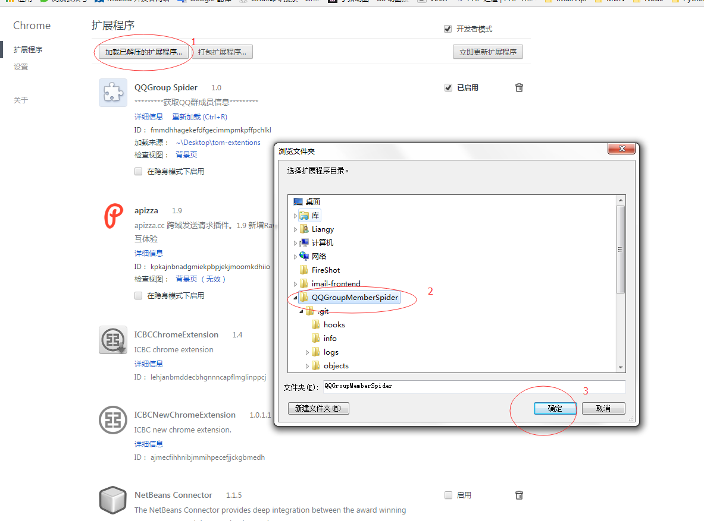
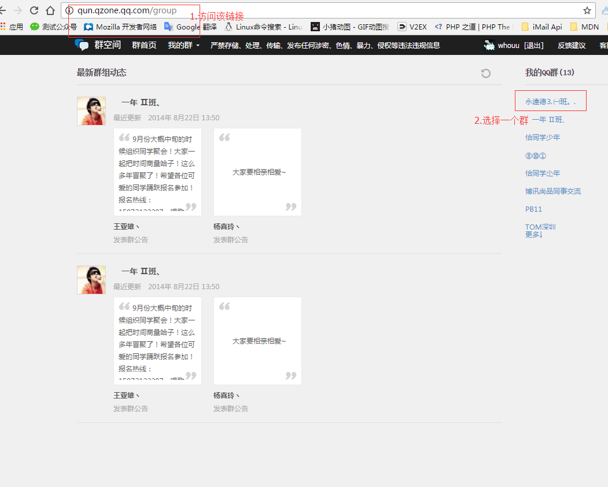
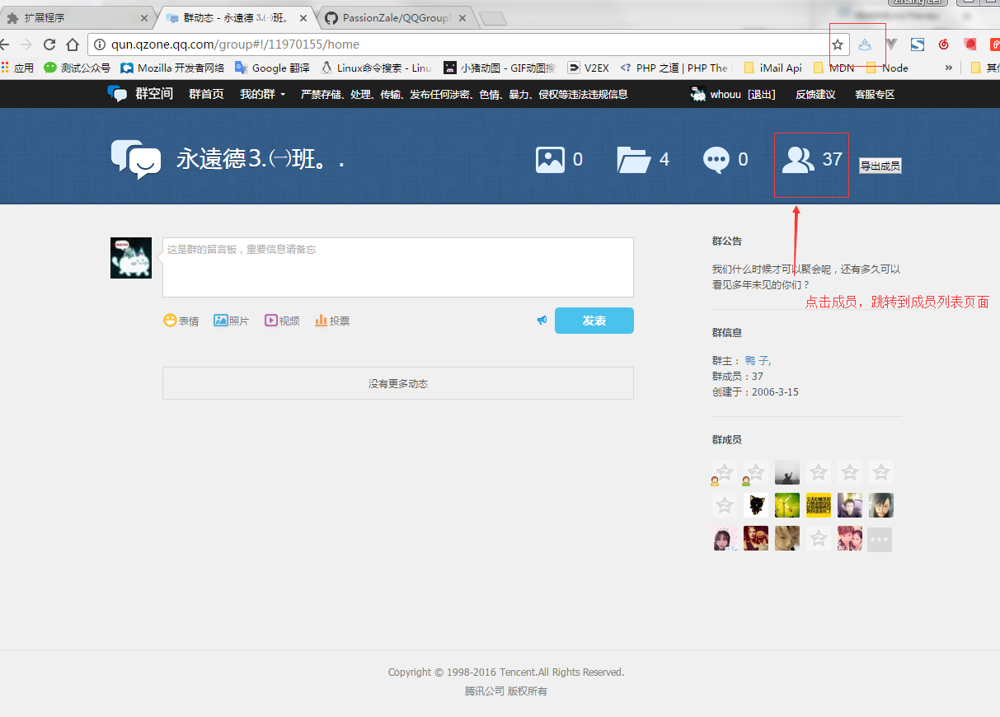
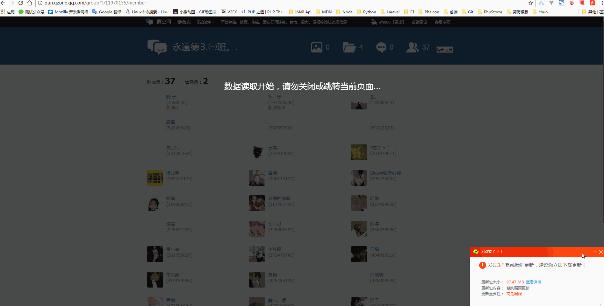
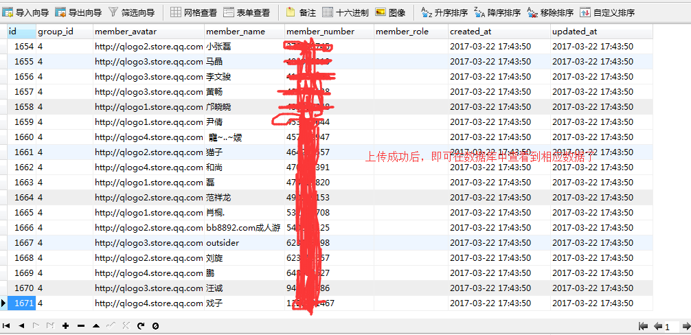

# Crawl QQ group members number

## 安装方式（如图）：



## 使用方式（如图）：








## 后端接口（mainifest.json）：

```json
{

    "name": "QQGroup Spider",
    "version": "1.0",
    "manifest_version": 2,
    "description": "*********获取QQ群成员信息*********",
    "browser_action": {
        "default_icon": "icon.png"
    },
    "permissions": [
        "webNavigation",
        "tabs",
        "contextMenus",
        "==》此处配置后端的域名，如:http://github.com《===",
        "notifications"
    ],
    "background": {
        "scripts": ["jquery-2.1.1.min.js", "eventPage.js"]
    },
    "content_scripts": [{
        "matches": ["http://qun.qzone.qq.com/group*"],
        "js": ["jquery-2.1.1.min.js", "contentscript.js"]
    }]
}
```
***在eventPage.js中，配置后端API接口具体地址***

## 数据库，API：
1. group_info.sql：QQ群表
2. group_member：QQ群成员表
3. Group.php：后端接口示例
